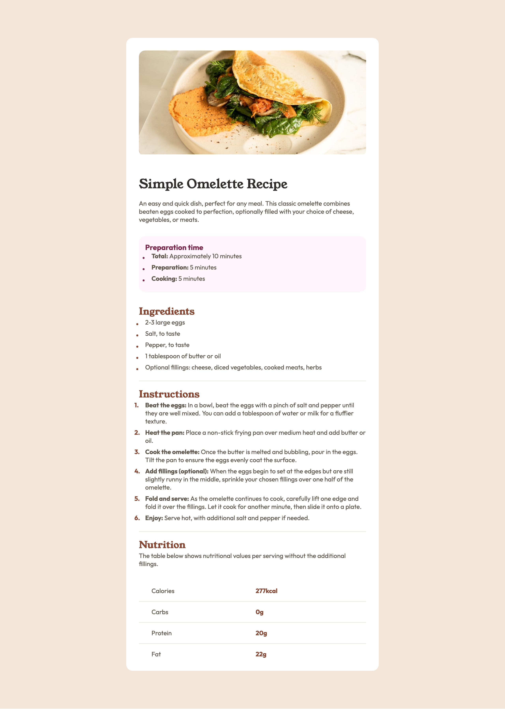
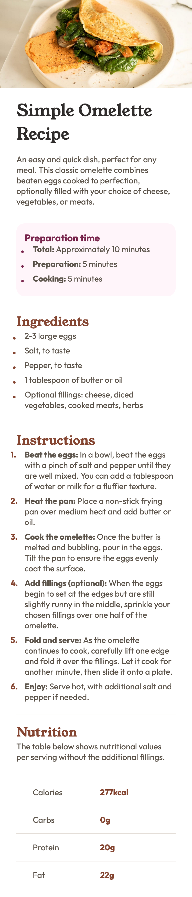

# Frontend Mentor - Recipe page solution

This is a solution to the [Recipe page challenge on Frontend Mentor](https://www.frontendmentor.io/challenges/recipe-page-KiTsR8QQKm). Frontend Mentor challenges help you improve your coding skills by building realistic projects. 

## Table of contents

- [Overview](#overview)
  - [The challenge](#the-challenge)
  - [Screenshot](#screenshot)
  - [Links](#links)
- [My process](#my-process)
  - [Built with](#built-with)
  - [What I learned](#what-i-learned)
  - [Continued development](#continued-development)
  - [Useful resources](#useful-resources)
- [Author](#author)

## Overview

### Screenshot




### Links

- Solution URL: [Add solution URL here](https://github.com/NathanMartinez/recipe-page-main)
- Live Site URL: [Add live site URL here](https://your-live-site-url.com)

## My process

### Built with

- Semantic HTML5 markup
- CSS custom properties
- Flexbox
- CSS Grid
- Mobile-first workflow

### What I learned

I learned how to adjust the list items using CSS custom properties to more match the design requirements.

```css

li {
  list-style: none; 
}

.custom-list li {
  display: inline-block;
  width: 100%;
  padding-left: 1rem;
  position: relative;
  padding-bottom: 0.5rem;
}

.custom-dot li::before {
  content: "\2022";
  font-size: 1.5rem;
  color: var(--brown-800);
  position: absolute;
  left: -0.5rem;
}

.prep-list li::before {
    color: var(--rose-800)
}

ol li {
    counter-increment: count;
}

ol li::before {
  content: counter(count)'.';
  font-size: 1rem;
  font-weight: bold;
  color: var(--brown-800);
  position: absolute;
  left: -0.7rem;
}

.nutrition {
    list-style-type: none;
    padding: 0;
}

.nutrition li {
    display: grid;
    grid-template-columns: 1fr 1fr;
    grid-gap: 1rem;
    padding: 1rem 2rem;
}

.nutrition li b {
    color: var(--brown-800);
}
```

### Continued development

### Useful resources

- [MDN Web Docs Counter()](https://developer.mozilla.org/en-US/docs/Web/CSS/counter) - This article explains how to use the counter() function in CSS to create numbered lists.
- [How to make and well-position HTML custom list marker](https://stackoverflow.com/questions/70927582/how-to-make-and-well-position-html-custom-list-marker) - This article provides a detailed guide on how to create custom list markers in HTML and CSS.

## Author

- GitHub - [NathanMartinez](https://github.com/NathanMartinez)
- Frontend Mentor - [@NathanMartinez](https://www.frontendmentor.io/profile/NathanMartinez)
- LinkedIn - [Nathan Martinez](www.linkedin.com/in/nathan-m-145133288)
